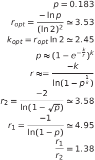

# ABySS-Connector: Connecting Paired Sequences with a Bloom Filter de Bruijn Graph
#### _Note: Submission Requirements for HiTSeq 2014_

Full paper submissions to HiTSeq 2014 have the same requirements as "Original Paper" submissions to "Bioinformatics", as described at http://www.oxfordjournals.org/our_journals/bioinformatics/for_authors/general.html. Briefly, the requirements are:

* Submission deadline: April 6, 2014
* Preferred submission formats: Word 2003 for document, .TIF or .EPS for images
* Up to 7 pages in length (~ 5000 words)
* The research must be demonstrated with real biological data, not just simulated data
* Recommended Structure:
  * Title page
  * Structured Abstract
    * Motivation
    * Results
    * Availability and Implementation
    * Contact
    * Supplementary Information
  * Introduction
  * System and methods
  * Algorithm
  * Implementation
  * Discussion
  * Acknowledgements
  * Funding
  * References

## Abstract

Paired-end sequencing yields a read from each end of a DNA molecule, typically leaving a gap of unsequenced nucleotides in the middle of the fragment. We have developed ABySS-Connector, a software tool to fill in the nucleotides of the unsequenced gap by navigating a de Bruijn Graph to find a path between the two reads and connect the pair. ABySS-Connector represents the de Bruijn graph using a Bloom filter, a probabilistic and memory-efficient data structure that represents a set. Our implementation is able to store the de Bruijn graph using a mean 1.5 bytes of memory per k-mer, a marked improvement over the typical hash table data structure. The memory usage per k-mer is independent of k, enabling its application to larger genomes. The use of a Bloom filter to represent a de Bruijn graph has previously been described for genome sequence assembly, a task which benefits from a second non-probabilistic data structure to enumerate the critical false positives. We observe that this additional data structure is unnecessary for connecting reads, reducing memory requirements. The de Bruijn graph of the 20-gigabase white spruce genome sequencing data, for example, can be represented in 40 gigabytes. Those k-mers observed only once are usually erroneous, and so discarded by using a counting Bloom filter. Constructing the Bloom filter is parallelized and distributed over multiple machines, and
connecting the reads is likewise parallelized and distributed. ABySS-Connector is expected to have broad applications in genomic analysis, including read alignment, sequence assembly and haplotype variant calling.

## Introduction

The task of constructing a genome sequence from short randomly sampled DNA sequences ("reads"), without reference to any previously assembled genome, is known as the *de novo assembly problem*. The first de novo genome assemblers were developed to process Sanger reads having lengths of approximately 800bp and generally followed an overlap-layout-consensus (OLC) approach. In the OLC approach, the overlap step constructs a graph representing overlaps between reads, the layout simplifies the graph and finds a path through the nodes, and the consensus step determines a consensus sequence among reads that overlap the same genomic location. With the transition to massively parallel second-generation sequencing technologies such as Illumina HiSeq, the input sequencing data to assemblers became both shorter (50bp-300bp) and vastly more abundant, presenting new algorithmic and computational challenges for genome assembly. One of the key algorithmic advances during this period was the development of the de Bruijn graph assembly algorithm by Pevzner, et al (**cite**).  Under the de Bruijn graph assembly approach, reads are first shredded into substrings of a fixed length k, called *k-mers*, and a graph is constructed where nodes represent kmers and edges represent overlaps of k - 1 bases. Similarly to the OLC paradigm, the assembly problem then translates to the problem of finding a path through the graph; however the de Bruijn paradigm has proved to be more tractable on large genomes due to the fixed size overlaps between kmers. In spite of the advances in both sequencing technologies and assembly algorithms over the past decade, the de novo assembly of large genomes remains a major challenge not only in terms of the correctness and completeness of the assembled genomes, but also with respect to the computational scalability of the algorithms.

One of the key characteristics of both first-generation (i.e. Sanger) and second-generation sequencing methods (e.g. Illumina HiSeq) is the use of a paired-end tag (PET) sequencing strategy. Under the PET sequencing approach, short DNA sequences (50bp-300bp) are determined from each end of a DNA fragment and the pairing relationship of the sequences is recorded for downstream use. Although the size of the sequenced DNA fragments typically varies according to a normal distribution, the pairing between reads nonetheless provides valuable distance information that has been successfully exploited by assemblers to improve both the quality and completeness of assemblies. In particular, many assembly pipelines (*cite*) incorporate *scaffolding algorithms* that map paired end reads across contigs to determine their relative distances and ordering; in addition, many stand-alone scaffolding algorithms have been implemented outside of assembly packages.     

As second-generation sequencing technologies have improved, it has been possible to extend the paired end reads far enough into the DNA fragments that they actually overlap. This presents an opportunity to combine the overlapping reads into a single long sequence, which has alternately been referred to as a "pseudoread", "merged read", or "super-read". Numerous tools have been developed to merge overlapping paired end reads, and their evaluation has demonstrated that using pseudoreads as input to assembly pipelines significantly improves the quality of assemblies.

## Method

ABySS-Connector determines the unknown nucleotide sequence in the gap between two paired-end reads by finding a connecting path through a de Bruijn graph. If a suitable path or set of paths can be found, the sequence corresponding to the connecting path(s) is inserted between the two reads and the full sequence for the DNA fragment is output as a single "pseudoread".

ABySS-Connector operates in three steps.  In the first step, the kmers from all of the paired end reads are loaded into a bloom filter representing the de Bruijn graph.  In the second step, a bidirectional graph search is carried out between each pair of reads to find connecting paths.  In the third and final step, a consensus sequence is constructed for each read pair which has multiple connecting paths, or the connecting sequence is used unmodified in the case of a unique path.

### The Bloom filter de Bruijn graph data structure

A Bloom filter ([bloom][]) is a probabilistic and memory-efficient data structure that represents a set of elements.
A de Bruijn graph may be represented using a Bloom filter, where the presence or absence of a k-mer in the graph is indicated by the Bloom filter.
The use of a Bloom filter to represent a de Bruijn graph has been described previously for partitioning assembly graphs ([khmer][]) and genome sequence assembly ([minia][]).

A Bloom filter is a probabilistic data structure.
If the k-mer is present, it will certainly return true.
If however the k-mer is not present, it may incorrectly return true with some probability, the false positive rate (FPR).
The FPR is determined by the size of the Bloom filter, the number of distinct elements inserted and the number of hash functions.

The khmer paper ([khmer][]) showed using percolation theory that an appropriate FPR for a DNA de Bruijn graph is 0.183.
The optimal number of hash functions for this FPR is two (see the supplementary material).
Using additional hash functions comes with a computational cost.
To improve performance and for ease of implementation, we use a single hash function, which comes at the cost of an increase in memory usage of 40% from the theoretical optimum of 3.6 bits per k-mer to 5.0 bits per k-mer.

k-mers observed only once in the data are usually erroneous.
A Bloom filter indicates only presence or absence and does not count the number of occurrences.
A counting filter may be used to return not just presence or absence of a k-mer, but an upper bound on the number of occurrences of that k-mer.
Using two bits per bucket, for example, a counting filter can report, 0, 1, 2 or 3+ occurrences.
Rather than using a counting filter, we use a cascade of two Bloom filters.
Although not strictly necessary, both filters are the same size in our implementation.
The second filter could be smaller because fewer k-mer are inserted, reducing memory usage.
Using a cascade of two equal-sized Bloom filters doubles the memory requirement to 10 bits per k-mer.
Once the Bloom filter is constructed, the first filter may be discarded, reducing the memory requirement to 5 bits per k-mer.

When inserting a k-mer, we check for its presence in the first filter.
If it is not found, it is inserted in the first filter.
If it is found, it is inserted in the second filter.
When testing for the presence of a k-mer, if it is not found in the first filter, it does not occur in the data set.
If it is not found in the second filter, it occurs at most once in the data set, and may be discarded from the graph.

### Finding Connecting Paths within the de Bruijn Graph

 _Placeholder Figure: Bidirectional breadth first search between paired-end reads in the de Bruijn graph. The real figure should more clearly depict the chosen start/end kmers, the expanding nature of the search, and the common edge connecting the two traversals._ 

The Bloom filter stores only the set of kmers that are present in the de Bruijn graph; information about edges is not recorded. Instead, ABySS-Connector traverses edges by querying the Bloom filter for each of the four possible neighbour kmers at each step.

The search for paths between paired end reads is subject to several contraints. The kmers that make up the first and second reads constitute a set of possible start and end nodes for the path search, and any path that connects kmers in the two sets is a potential solution.  It is important to identify all possible paths between the first and second reads in order to ensure the correctness of any DNA sequences that are generated by the tool.  The sequences produced from a unique connecting path are guaranteed to be correct (with the exception of sequencing errors), whereas merging read pairs with alternate connecting paths may or may not be desirable depending on the similarity of the paths.  Finally, the connecting paths should be contrained to minimum and maximum length as dictated by the DNA fragment size distribution that produced the reads.

The first step of the search algorithm is to select a single _start kmer_ from the first read and a single _goal kmer_ from the second read as endpoints for the path search. The choice of start and goal kmers can have a significant effect on the speed of the algorithm because it alters the distance between the path endpoints and hence the maximum depth limit of the search. For this reason, the default behaviour of the algorithm is to select start and goal kmers that are as close as possible to the ends of the reads. It is not guaranteed that every kmer in a read will be present in the graph because kmers that occur only once are excluded from the second level Bloom filter. With the exception of low coverage sequence, singleton kmers are caused by sequencing errors.

The graph search algorithm used by ABySS Connector is a depth-limited, bidirectional breadth-first search. In scenarios where the goal and start node are both known, bidirectional search algorithms reduce the expansion of the search frontier and thus offer significant performance advantages over standard unidirectional search algorithms ([Pohl][]). Breadth-first search was chosen over depth-first-search for this application because it allows the minimum distance of each node from the start/goal node to be tracked during the traversal, which is in turn used to enforce the depth limit for the search. ABySS Connector's search algorithm is a modification of a standard breadth-first algorithm which tracks the state two simultaneous breadth-first searches, and alternates between them with the addition of each new edge. Whereas a standard breadth-first search implementation use a single data structure to track the status of each node (unvisited, previously visited, or exhausted), the bidirectional version uses two such data structures and requires that the two traversals check each other's node states in order to detect when the traversals overlap.  Pseudocode for the algorithm is provided is Supplementary Figure **XXX**.

### Reconciling Alternate Paths between Read Pairs

When two pairs have been connected by a unique path between the two reads, the original sequence is then replaced with the kmer sequence that links the two reads flanked by the segments of reads that occurred before the start node and after the end node. When there were multiple paths between the connected pairs, a pair wise Smith-Waterman (ref) sequence alignment is performed between each path requiring that there be less than some threshold of mismatches. A consensus sequence can then be reported using IUPAC (ref) ambiguity codes to represent mismatches between paths. Similar to when there is a unique path, the consensus is reported with the sequences of the original read pairs on either side.

## Results

### Synthetic Data: Human Chromosome 21

**Figure: ABySS-connector performance as a function of k, depth of coverage, sequencing base error, fragment length and Bloom filter false positive rate (FPR). The theoretical performance limit and ideal running conditions of ABySS-connector was assessed using synthetic datasets**.  Paired-end (PE) reads were simulated using the Illumina-error profiler pIRS (Hu et al., 2012) on the hg19 human chromosome 21 reference only (haploid) and the reference and a diploid copy with indel and heterozygous SNP rate of 0.01 and 0.1%, respectively (diploid).  Unless otherwise specified by the condition under scrutiny, we simulated, in duplicate experiments, 50-fold coverage 0.1% error PE100 reads from 400 bp fragments (~12 M read pairs).  The ideal k-value for running ABySS-connector on these data was determined to be 60 and a Bloom filter size of 30GB was used to ensure optimum performance, unless otherwise stated.  Each point shows the mean value of the measure.

HG19 human chromosome 21 was used as a haploid source for read simulation.  Using the sequence simulator pIRS (Hu et al., 2012), we created a diploid copy of chromosome 21 (v 1.1.1; pirs diploid -i chr21.fa with default values) with an indel, heterozygous and structural variation rate of 0.1, 0.01 and 0.0001%, respectively. In separate experiments, we simulated paired-end reads (PE) from those haploid and diploid sources using the Illumina base calling error profile simulator pIRS (pirs simulate -i chr21.fa -I chr21copy.fa.snp.indel.inversion.fa -l 100 -x 50 -m 400 -e 0.001) to test the effect of k-mer sizes on ABySS-connector assemblies (v1.0; abyss-connector -v -v -j 12 -k $k -b 30G -B 300 -F 700).  Assembly conditions such as depth of coverage, base errors and fragment lengths were tested by adjusting the parameters of the read simulator in accordance with the measure tested while setting the assembly k-value to that of the optimal assemblies (k=60).  Likewise, the effect of the Bloom filter size (ABySS-connector –b option) was adjusted to measure false-positives k-mers in the data structure and the resulting impact on assembly yield. Bloom filter sizes ranging from 5MB to 500MB were assessed for this purpose, but set high (30GB) for other runs to maximize the assembly yield.

Optimally, under the best conditions of coverage, k value, realistic base error (0.1%) and fragment length (400bp) for 100nt long reads, we could assemble 91.5% (SD +- 0.002%) and 93.0 % (SD +- 0.004%) from diploid and haploid sources, respectively.  We could not test the effect of longer reads with pIRS since no error model based on the Illumina sequencing platform were available for cycles >100.  However, using the same specifications (50-fold, 0.1% base error, 30GB Bloom filter size in memory) and a slightly larger k value (70), but with randomly distributed sequence base errors, 98.4% of wgsim-simulated PE150 from haploid human chromosome 21 assembled (data not shown).
	With the exception of assessing the Bloom filter FPR, we allocated the maximum number of RAM (30GB) for building the Bloom filter in memory.  With such as small dataset, a Bloom filter size of 500MB was sufficient to assemble 90.3% of the pairs despite a FPR of 3.5% (Figure 2).  It was determined that, with the synthetic datasets tested (~12M x PE100 read pairs), allocating 80MB of RAM was the lowest practical limit to minimize the effect of FPR on assembly yield.  In practice, using the maximum available RAM to build the Bloom filter will ensure a lower FPR and better connectivity.  Of course, large sequence read datasets such as  Picea glauca push the memory limit on commodity hardware and limiting RAM can only be overcome by XXX.
	
### Real Data: Illumina Sequencing for Human Individual NA19238

Data: https://www.ebi.ac.uk/ena/data/view/PRJEB4252

## References

[bloom]: http://dl.acm.org/citation.cfm?doid=362686.362692
[khmer]: http://www.pnas.org/content/109/33/13272
[minia]: http://www.almob.org/content/8/1/22
[Pohl]: Pohl, Ira (1971), "Bi-directional Search", in Meltzer, Bernard; Michie, Donald, Machine Intelligence 6, Edinburgh University Press, pp. 127–140

# Supplementary Material

## Number of bits per k-mer

+ $p$ is the false positive rate
+ $k$ is the number hash functions
+ $k_{opt}$ is the optimal number hash functions
+ $r$ is the number of bits per k-mer
+ $r_1$ is the number of bits per k-mer using one hash function
+ $r_2$ is the number of bits per k-mer using two hash functions

$$
p = 0.183
\\
r_{opt} = \frac{- \ln p}{(\ln 2)^2} \simeq 3.53
\\
k_{opt} = r_{opt} \ln 2 \simeq 2.45
\\
p \approx (1 - e^{-\frac{k}{r}})^k
\\
r \approx = \frac{-k}{\ln (1 - p^{\frac{1}{k}})}
\\
r_2 = \frac{-2}{\ln (1 - \sqrt{p})} \simeq 3.58
\\
r_1 = \frac{-1}{\ln (1 - p)} \simeq 4.95
\\
\frac{r_1}{r_2} = 1.38
$$
